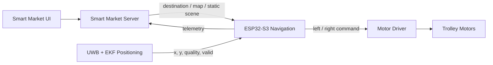

# Smart Trolley Autonomous Navigation System

**Design and Development of an Autonomous Smart Trolley Navigation System Based on UWB Using the Dijkstra Algorithm for Path Planning**

An indoor smart-market trolley that receives its position from an external
UWB/EKF positioning subsystem, plans the shortest route through a graph of the
store using **Dijkstra**, converts that route into waypoints and follows it with
a **differential-drive PID controller** on an **ESP32-S3**.

This repository contains the navigation subsystem only: positioning (UWB/EKF),
the market backend and the customer application are external modules with
documented interfaces.

---

## 1. Objective

Navigate autonomously from the trolley's current position to a selected
destination node inside a Smart Market:

1. receive the current position from the UWB positioning subsystem,
2. snap it onto the navigation graph,
3. load static obstacles from the positioning scene,
4. exclude graph edges that intersect those obstacles,
5. compute the shortest safe route with Dijkstra,
6. convert that route into waypoints,
7. estimate heading from successive positions,
8. generate linear/angular velocity commands,
9. convert them into left/right wheel commands,
10. drive the motors through a PID heading controller,
11. detect waypoint arrival and advance automatically,
12. detect route deviation and replan,
13. detect invalid or lost positioning and stop safely,
14. detect destination arrival and stop,
15. publish telemetry for external modules.

## 2. Architecture



Three layers, one algorithm implementation:

```text
        navigation_core/  (portable C++17, no Arduino, no I/O)
                 |
       +---------+---------+
       |                   |
  simulator/           firmware/
  (Python + ctypes)    (ESP32-S3, Arduino, FreeRTOS)
       |                   |
   mock UWB            Serial / real UWB adapter
```

The desktop simulator does **not** reimplement navigation. It loads the same C++
sources as a host shared library (`build/native/navcore.dll`) and drives them
through a small C ABI (`navigation_core/include/navigation/c_api.h`). Dijkstra,
the waypoint manager, the PID and the state machine are therefore literally the
same code in both environments. See [docs/architecture.md](docs/architecture.md).

## 3. Directory structure

```text
smart-trolley-navigation/
├── README.md                     this file
├── platformio.ini                native + ESP32-S3 environments
├── navigation_core/              portable C++17 navigation algorithms
│   ├── include/navigation/       public headers
│   └── src/                      implementation
├── firmware/                     ESP32-S3 firmware (Arduino + FreeRTOS)
│   ├── include/                  app_config, pin_config, drivers
│   └── src/                      main.cpp, motor driver, telemetry
├── simulator/                    desktop 2D simulator (Python + pygame)
│   ├── main.py                   entry point
│   └── smart_trolley_sim/        simulator package
├── config/                       map.json, graph.json, navigation.json, simulator.json
├── tests/                        C++ unit + integration tests (Unity)
├── test_data/                    JSONL UWB fixtures, scenarios, route fixtures
├── scripts/                      build/test/mock-position tooling
├── wokwi/                        optional ESP32 logic-only test environment
├── docs/                         architecture, algorithms, contracts, guides
├── logs/                         simulator CSV telemetry (generated)
└── results/                      simulator JSON summaries (generated)
```

## 4. Requirements

| Component | Requirement |
|---|---|
| Python | 3.9+ (3.11 tested), `pygame`, `numpy` |
| C++ toolchain | g++ 9+ / clang++ (host build of the navigation core) |
| PlatformIO | Core 6.x, `espressif32` platform 6.11.0 |
| ESP32 board | ESP32-S3-DevKitC-1 |
| Optional | `pyserial` (for the hardware-in-the-loop mock position generator) |

Windows: install [MSYS2](https://www.msys2.org/) for `g++` (the build script also
finds it automatically at `C:\msys64\ucrt64\bin\g++.exe`). All commands below are
Windows-friendly; serial ports are `COM3`, `COM4`, `COM5`, ….

## 5. Quick start

```bat
cd smart-trolley-navigation

python -m venv .venv
.venv\Scripts\activate

python -m pip install -r simulator/requirements.txt

python simulator/main.py
```

The first run compiles the navigation core into a shared library automatically.
The simulator window opens on scenario 1.

Rebuild the shared core explicitly (after changing anything under
`navigation_core/`) with:

```bat
python scripts/build_native_core.py --force
```

The build is atomic: it compiles to a temporary name and swaps the file in, so a
Python process still holding the previous library cannot block it.

### Run the tests

```bat
pio test -e native
```

### Build and flash the firmware

```bat
pio run
pio run --target upload
pio device monitor
```

## 6. Running the simulator

```bat
python simulator/main.py                    :: interactive, scenario 1
python simulator/main.py --scenario 5       :: start on scenario 5
python simulator/main.py --list             :: list the 14 scenarios
python simulator/main.py --speed 2          :: 2x time scale
python simulator/main.py --headless --all   :: run every scenario, print a table
python simulator/main.py --headless --all --json results/sweep.json
```

### Choose any destination

```bat
python simulator/main.py --list-nodes                        :: show node names
python simulator/main.py --destination 4                     :: by node id
python simulator/main.py --destination produk-susu            :: by node name
python simulator/main.py --destination-at 9.0 5.5            :: nearest node to a point
python simulator/main.py --start-at 9.5 5.8 --destination 1  :: custom start and destination
```

Nodes in `config/graph.json` carry an optional `name` (`masuk`, `kasir`,
`produk-susu`, `parkir`, ...), which is accepted case-insensitively. An unknown
name fails with the list of known names instead of silently using the default.

Interactively, **left-click anywhere on the map** to retarget the trolley: the
nearest graph node becomes the destination and the route is replanned on the spot.
Hovering shows which node a click will pick (magenta ring). A click further than
`max_pick_distance_m` (1.5 m) from every node is refused with a reason, so an
empty corner cannot silently target a node metres away.

Keyboard controls (also shown in the status panel):

| Key | Action | Key | Action |
|---|---|---|---|
| `1`–`9` | switch scenario | `SPACE` | run / pause |
| **left-click map** | set destination to the nearest node | **right-click** | start / resume |
| **middle-click** | cancel navigation | | |
| `Z` / `X` | previous / next destination node | `ENTER` | start / resume navigation |
| `R` | reset the run | `P` | force a replan |
| `N` | toggle UWB noise | `D` | toggle UWB dropout |
| `J` | inject a position jump | `I` | toggle invalid samples |
| `Q` | toggle low quality | `F` | toggle frozen position |
| `E` | emergency stop | `C` | clear E-stop (does **not** resume) |
| `G` | toggle node labels | `T` | toggle trajectory |
| `H` | toggle debug overlay | `ESC` | quit |

`C` deliberately only clears the emergency stop: motion resumes exclusively via
`ENTER`, which re-validates the position and the route first.

Each run writes `logs/<scenario>_runNNN_<timestamp>.csv` and
`results/<scenario>_runNNN_<timestamp>_summary.json`.

## 7. Running the scenarios

All fourteen scenarios are deterministic for the configured seed
(`config/simulator.json → simulation.random_seed`).

```bat
python scripts/run_simulator.py --scenario 1  --headless
python scripts/run_simulator.py --scenario 6  --headless
python scripts/run_simulator.py --all --headless --json results/sweep.json
```

| # | Scenario | Demonstrates |
|---|---|---|
| 1 | `scenario_01_basic_navigation` | baseline route with a clean signal |
| 2 | `scenario_02_long_route` | longest route across the market |
| 3 | `scenario_03_multiple_turns` | corner slowdown and repeated turns |
| 4 | `scenario_04_moderate_uwb_noise` | noise σ = 0.10 m |
| 5 | `scenario_05_high_uwb_noise` | noise σ = 0.20 m |
| 6 | `scenario_06_position_dropout` | 2 s dropout → `POSITION_LOST` → recovery |
| 7 | `scenario_07_low_quality_position` | quality below threshold |
| 8 | `scenario_08_position_jump` | 1.5 m measurement jump → replan |
| 9 | `scenario_09_route_deviation` | physical displacement → replan |
| 10 | `scenario_10_destination_change` | destination changed mid-route |
| 11 | `scenario_11_unreachable_destination` | no route → `ERROR`, motors stopped |
| 12 | `scenario_12_emergency_stop` | E-stop, then safe recovery |
| 13 | `scenario_13_invalid_samples` | `valid=false` samples rejected for 4 s |
| 14 | `scenario_14_frozen_position` | frozen UWB output treated as stale data |

## 8. Building and uploading the ESP32-S3 firmware

```bat
pio run                              :: build (env: esp32-s3-devkitc-1)
pio run -e esp32-s3-devkitc-1-mock   :: build with mock/Serial position input
pio run --target upload              :: flash
pio device monitor                   :: serial console at 115200 baud
pio run --target clean
```

Verified build output: RAM 15.3 %, Flash 10.9 % of the default partition table.

## 9. Testing with mock UWB data

The firmware accepts the documented position JSON on the console UART. Generate
it on the PC and send it over USB serial:

```bat
:: generate a route-following stream with noise and dropouts
python scripts/generate_mock_position.py --port COM5 --trajectory route ^
    --noise 0.10 --dropout 0.05 --invalid 0.02

:: replay a trajectory recorded by the simulator
python scripts/generate_mock_position.py --port COM5 --trajectory csv ^
    --csv logs/scenario_01_run001_2026-10-03_10-00-00.csv

:: preview the stream without a serial port
python scripts/generate_mock_position.py --dry-run --duration 2
```

Then, in `pio device monitor`:

```text
CMD:destination 11
CMD:start
CMD:status
```

Available console commands: `help`, `status`, `graph`, `route`, `position`,
`destination <n>`, `start`, `stop`, `cancel`, `estop`, `clear_estop`, `replan`,
`debug on|off`.

## 10. ESP32-S3 pin assumptions

Configured in [`firmware/include/pin_config.hpp`](firmware/include/pin_config.hpp):

| Signal | GPIO | Notes |
|---|---|---|
| Left motor PWM | 4 | LEDC ch. 0, 20 kHz, 10-bit |
| Left motor IN1 / IN2 | 5 / 6 | direction |
| Right motor PWM | 7 | LEDC ch. 1 |
| Right motor IN1 / IN2 | 15 / 16 | direction |
| Status LED | 2 | optional |
| UWB UART RX / TX | 43 / 44 | UART1, reserved for real integration |
| Encoders (reserved) | 17/18, 8/9 | not used in open-loop mode |

Pins avoid the ESP32-S3 flash/PSRAM (26–32) and native-USB (19/20) pins.

## 11. Configuration parameters

| File | Purpose |
|---|---|
| [`config/map.json`](config/map.json) | map id/version, frame, dimensions |
| [`config/graph.json`](config/graph.json) | nodes, edges, node types |
| [`config/navigation.json`](config/navigation.json) | all navigation tuning |
| [`config/simulator.json`](config/simulator.json) | window, physics, sensor model, logging |

Key navigation parameters:

| Parameter | Default | Meaning |
|---|---|---|
| `position.minimum_quality` | 0.60 | reject samples below this quality |
| `position.timeout_ms` | 750 | stop the trolley after this without a valid position |
| `position.heading_min_displacement_m` | 0.50 | baseline before a position-derived heading correction |
| `path.max_graph_snap_distance_m` | 1.5 | furthest distance to snap a position onto the graph |
| `path.replan_max_graph_snap_distance_m` | 2.5 | wider snap radius used when replanning |
| `path.waypoint_tolerance_m` | 0.20 | waypoint acceptance radius |
| `path.destination_tolerance_m` | 0.15 | destination acceptance radius |
| `path.max_cross_track_error_m` | 0.40 | soft deviation limit |
| `path.replan_cross_track_error_m` | 0.60 | deviation that triggers a replan |
| `path.route_deviation_confirm_ms` | 500 | confirmation window before replanning |
| `path.replan_cooldown_ms` | 1000 | minimum interval between replans |
| `motion.max_linear_speed_mps` | 0.45 | cruise speed |
| `motion.rotate_in_place_threshold_deg` | 55 | heading error that switches to spin-in-place |
| `motion.max_angular_speed_radps` | 2.2 | yaw-rate ceiling; the dominant corner-tracking limit |
| `motion.heading_deadband_deg` | 1.5 | taper the angular command inside this error (straight-line stability) |
| `motion.max_motor_command_change_per_s` | 6.0 | wheel-command slew limit (0 disables) |
| `path.destination_slowdown_distance_m` | 0.60 | final-approach speed taper |
| `drive_kind` | `stepper` | `stepper` (NEMA 17 + A4988) or `pwm_h_bridge` |
| `stepper.microsteps` | 16 | must match the A4988 MS1/MS2/MS3 wiring |
| `robot.wheel_base_m` | 0.32 | distance between the driven wheels |
| `robot.max_wheel_speed_mps` | 0.70 | wheel speed needed for max cruise + max turn |
| `control.navigation_rate_hz` | 20 | control loop rate |

Validate every file (including cross-file consistency) with:

```bat
python scripts/validate_config.py
```

## 12. UWB integration contract

The navigation system consumes **processed positions**, never raw ranging values.
The positioning subsystem (UWB ranging + EKF) must publish:

```json
{
  "schema_version": 1,
  "trolley_id": "TROLLEY_01",
  "frame_id": "smart_market_map",
  "timestamp_ms": 123456,
  "position": { "x_m": 3.42, "y_m": 5.11 },
  "quality": 0.96,
  "valid": true
}
```

Coordinate frame: origin at the **bottom-left** corner of the market map,
`X+` right, `Y+` up, units in **meters**, angles counter-clockwise from `+X`.
Samples are rejected when `valid == false`, the frame or schema version differs,
a coordinate is NaN/infinite, the timestamp is missing or stale, the quality is
below `minimum_quality`, or the position is far outside the map. Full details:
[docs/data_contract.md](docs/data_contract.md) and
[docs/integration.md](docs/integration.md).

## 13. Destination integration contract

Development sources: a serial command (`CMD:destination 11`), the simulator, or
a hardcoded test destination. Later: the Smart Market backend.

```text
GET  /map                  map metadata (id, version, frame, dimensions)
GET  /graph                navigation graph (nodes + edges)
GET  /destination          current destination request for a trolley
POST /navigation/status    telemetry as published by the trolley
```

See [docs/integration.md](docs/integration.md) for example payloads. The
simulator and firmware work entirely without a server.

## 14. Tests

```bat
pio test -e native                     :: all C++ suites (unit + integration)
pio test -e native -f test_dijkstra    :: one suite
python scripts/validate_config.py      :: configuration validation
python simulator/main.py --headless --all   :: all scenarios
python scripts/generate_route_fixtures.py --check
python scripts/generate_test_data.py --check
python scripts/generate_reference_results.py --check
```

| Suite | Covers |
|---|---|
| `test_graph_dijkstra` | graph construction/validation, Dijkstra correctness, nearest node, cross-track |
| `test_geometry_pid_drive` | angle maths, point-to-segment, PID (saturation, anti-windup, dt guards), differential drive |
| `test_waypoint_fsm` | waypoint progression, heading estimation, deviation monitor, FSM transitions, JSON contract, telemetry |
| `test_command_parser` | console command parsing, shared route fixtures |
| `test_integration` | full pipeline with a plant in the loop: arrival, position loss, E-stop, destination change, unreachable destination, deviation replan |

## 15. Known hardware assumptions

* ESP32-S3-DevKitC-1, Arduino framework, C++17, PlatformIO.
* Generic dual H-bridge driver (TB6612FNG / L298N / DRV8833 class) on LEDC PWM.
* Two driven wheels, differential drive, wheel base 0.32 m, wheel radius 0.05 m.
* Actuator selected by `drive_kind` in `config/navigation.json`: **`"stepper"`**
  (NEMA 17 + A4988 step/dir, the default) or `"pwm_h_bridge"` (DC motor with an
  H-bridge). Stepper control exposes STEP-rate/RPM conversion, an acceleration
  profile, exact position in steps/revolutions, direction and bench commands
  (`CMD:rpm`, `CMD:move`, `CMD:zero`, `CMD:stepper`).
* No encoders in the default build: the heading comes from position
  differences plus commanded yaw-rate dead reckoning. Encoder pins are reserved
  (`CLOSED_LOOP_ENCODER` mode) and the abstraction is already in place.
* The UWB/EKF subsystem is external and provides `(x, y, quality, valid)`.

## 16. Documentation

| Document | Contents |
|---|---|
| [docs/architecture.md](docs/architecture.md) | layering, task layout, state machine, data flow |
| [docs/navigation_algorithm.md](docs/navigation_algorithm.md) | graph model, Dijkstra, follower, PID, equations |
| [docs/coordinate_system.md](docs/coordinate_system.md) | frame, units, angle conventions |
| [docs/data_contract.md](docs/data_contract.md) | position and telemetry schemas, validation rules |
| [docs/esp32_firmware.md](docs/esp32_firmware.md) | firmware structure, pins, tasks, commands, flashing |
| [docs/simulator.md](docs/simulator.md) | simulator usage, scenarios, metrics, logging |
| [docs/testing.md](docs/testing.md) | test suites, fixtures, how to add tests |
| [docs/integration.md](docs/integration.md) | UWB and backend interfaces, what to change at integration |
| [docs/troubleshooting.md](docs/troubleshooting.md) | common failures and fixes (simulator, tests, firmware, stepper, configuration, scripts) |

## 17. Troubleshooting

Something not working? [docs/troubleshooting.md](docs/troubleshooting.md) covers,
by symptom: the simulator refusing to start, `navcore.dll` build failures, a
trolley that circles or weaves, constant replanning, corner overshoot, stale
fixtures, C++ test discovery, ESP32 upload and watchdog resets, stepper motors
that buzz without turning or lose steps, and configuration validation errors.

Quick self-checks:

```bat
python scripts/validate_config.py                    :: configuration is valid
python simulator/main.py --headless --all            :: every scenario still passes
pio test -e native                                   :: all C++ suites pass
python scripts/generate_reference_results.py --check  :: documented results match a real run
```

## 18. Project status

Implemented and verified: navigation core, Dijkstra, waypoint tracking, PID,
differential drive, navigation FSM, replanning, position-loss safety, emergency
stop, telemetry, console commands, ESP32-S3 firmware, mock and real position
provider abstraction, desktop simulator, UWB fault simulation, metrics, CSV/JSON
export, unit tests and integration tests (111 passing), PlatformIO build for both
firmware environments, and this documentation set.

Hardware-dependent (structure complete, needs the real device): motor direction
and PWM polarity, wheel base/radius calibration, encoder feedback. Only
`firmware/include/pin_config.hpp` and `config/navigation.json` need editing. 

Future external integration: the real UWB/EKF provider
(`RealPositionProvider` in `firmware/include/position_provider.hpp`, already
wired to UART1) and the Smart Market backend.
