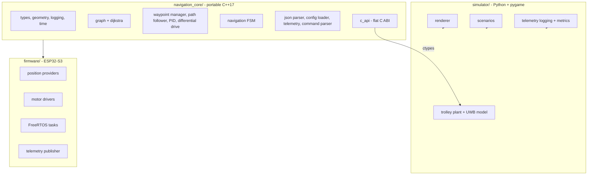
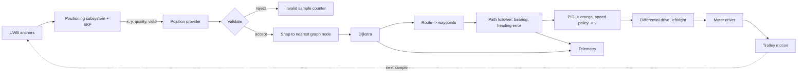
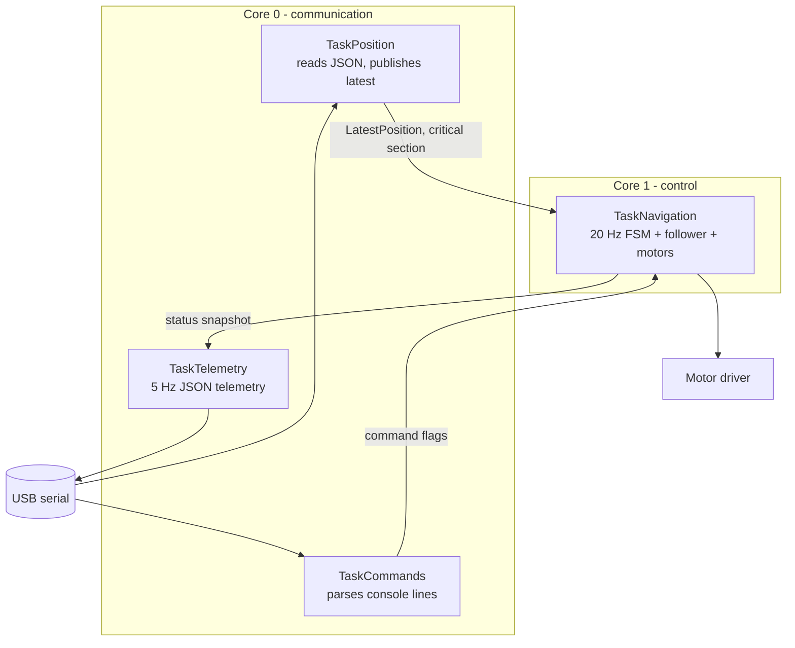
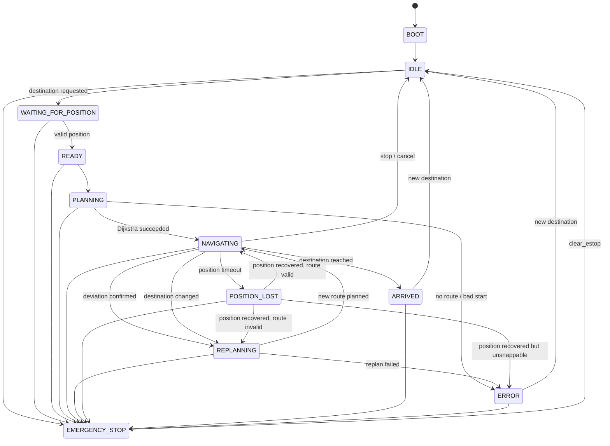

# System Architecture

## 1. Layering

The project is split into three layers so that navigation logic exists exactly
once and can be tested without hardware.



The core has **no** dependency on Arduino, GPIO, Wi-Fi, Serial, motor drivers,
graphics or Python. It is compiled into:

* the native test environment (`pio test -e native`),
* the ESP32-S3 firmware (directly, via `build_src_filter`),
* a host shared library used by the Python simulator (`scripts/build_native_core.py`).

Because all three consume the same translation units, a change to Dijkstra or the
follower cannot make the simulator and the firmware disagree.

## 2. Why a C ABI for the simulator

Reimplementing the navigation algorithms in Python would immediately create two
sources of truth. Instead:

```text
simulator/smart_trolley_sim/native_core.py   (ctypes bindings)
                |
                v
navigation_core/include/navigation/c_api.h   (flat C ABI, POD only)
                |
                v
navigation_core/src/c_api.cpp                (session wrapper)
```

`nav_state_name()` is compared against the Python enum table at load time, so an
ABI mismatch fails loudly instead of silently mis-indexing a struct.

The Python side owns only what is genuinely environment specific: trolley
physics, the UWB measurement model, rendering and experiment logging.

## 3. Data flow



The **ground-truth** pose exists only inside the simulator and is never passed to
navigation: the simulator feeds the core the *measured* position, exactly as the
firmware does.

## 4. Firmware task architecture



Design rules:

* the control loop runs on core 1 and is never blocked by telemetry or parsing;
* the position handoff is a single latest-value slot behind a `portMUX` critical
  section (no queue growth, no dynamic allocation);
* command flags are plain `volatile bool`s consumed once per cycle;
* the status snapshot is guarded by a mutex that the navigation task only takes
  with a zero timeout, so telemetry can never stall control;
* the task watchdog is subscribed **only** by the navigation task, so a stalled
  control loop reboots the device instead of driving blind.

## 5. Navigation state machine



Per-state behaviour (implemented in `navigation_core/src/navigation_fsm.cpp`):

| State | Motor output | Behaviour | Exit condition |
|---|---|---|---|
| `BOOT` | zero | initialise, validate graph and config | immediately → `IDLE` |
| `IDLE` | zero | waiting for a destination | destination requested → `WAITING_FOR_POSITION` |
| `WAITING_FOR_POSITION` | zero | waiting for a fresh valid sample | fresh position → `READY` |
| `READY` | zero | pre-planning step | → `PLANNING` |
| `PLANNING` | zero | snap position, run Dijkstra, build waypoints | success → `NAVIGATING`, failure → `ERROR` |
| `NAVIGATING` | **active** | heading update, waypoint advance, follower, deviation monitor | arrival / deviation / timeout |
| `REPLANNING` | zero | re-snap (wider radius) and re-run Dijkstra | success → `NAVIGATING` |
| `POSITION_LOST` | zero | waiting for a valid sample | recovery → `NAVIGATING` or `REPLANNING` |
| `ARRIVED` | zero | destination reached | new destination → `IDLE` |
| `ERROR` | zero | recoverable fault reported | new destination → `IDLE` |
| `EMERGENCY_STOP` | zero (latched) | all commands ignored | `clearEmergencyStop()` → `IDLE` |

**Safety invariant:** `status.motor` is non-zero **only** in `NAVIGATING`. Every
other state, including a failed plan, a stale position, a rejected command or a
latched E-stop, commands zero on both wheels.

Pass-through states (`BOOT`, `IDLE`, `WAITING_FOR_POSITION`, `READY`, `PLANNING`,
`REPLANNING`) are resolved within a single `update()` call (bounded to 8
transitions), so a request that already has a valid position starts moving in one
control cycle instead of burning a cycle per intermediate state.

## 6. Emergency stop semantics

`emergencyStop()` latches a flag that outranks every other input:

* the flag is checked at the top of `update()`, so no state can command motion;
* `requestDestination()` and `startNavigation()` are rejected while it is latched;
* the firmware additionally stops the motors before notifying the FSM, so the
  hardware cut does not depend on the software state machine running at all;
* `clearEmergencyStop()` never resumes motion: it returns to `IDLE`, keeps the
  destination in `heldDestination()`, and requires an explicit
  `startNavigation()` (console `start`) which re-validates position and route.

## 7. Configuration flow

```text
config/graph.json ──┐
config/navigation.json ──┴─> nav::loadGraph / loadNavigationConfig ──> nav::NavigationConfig
                                                                              |
                          firmware/src/app_context.cpp (built-in JSON strings) ─┘
                                                                              |
                                              nav::NavigationFsm::begin(&graph, config)
```

The firmware embeds the same two documents as string literals
(`builtinGraphJson()`, `builtinNavigationJson()`) so it can boot and navigate
without a filesystem or a server. `scripts/validate_config.py` validates the
files on disk, and the C++ loader validates the strings at boot.

## 8. Module boundaries (team contract)

```text
Positioning (UWB/EKF)  -> produces (x, y, quality, valid) in smart_market_map
Server / backend       -> provides the map, the graph and the destination
Navigation (this repo) -> turns position + destination into wheel commands
Motor layer            -> executes normalised left/right commands
```

Replacing the mock position provider with the real UWB adapter changes **only**
the provider implementation. Dijkstra, the graph, waypoint tracking, the PID,
motor calculations and the telemetry schema stay untouched
(see [integration.md](integration.md)).
