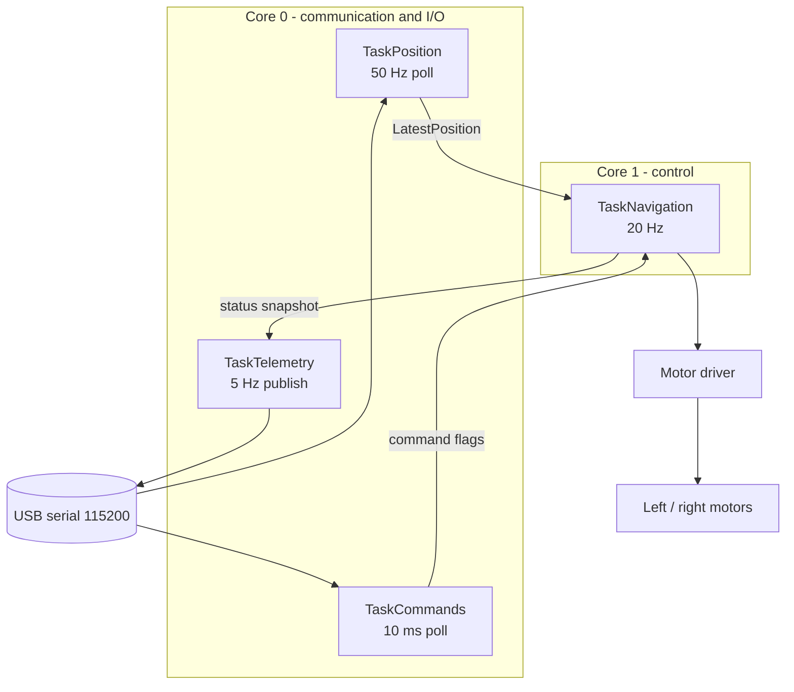

# ESP32-S3 Firmware

## 1. Overview

The firmware runs the navigation core on an ESP32-S3-DevKitC-1 under the Arduino
framework with FreeRTOS. It reads processed positions, runs the state machine at
20 Hz, drives two motors through an H-bridge and publishes telemetry.



Files:

| Path | Role |
|---|---|
| `firmware/src/main.cpp` | boot sequence, task definitions, safety gate |
| `firmware/src/app_context.cpp` | shared context + built-in graph/config JSON |
| `firmware/src/motor_driver.cpp` | H-bridge / null / simulated backends |
| `firmware/src/telemetry.cpp` | telemetry formatting and output sink |
| `firmware/include/app_config.hpp` | build-time feature flags, rates, task placement |
| `firmware/include/pin_config.hpp` | GPIO assignment |
| `firmware/include/position_provider.hpp` | Arduino stream adapter, real UWB provider, latest-position slot |
| `firmware/include/motor_driver.hpp` | `IMotorDriver` contract |
| `firmware/include/telemetry.hpp` | telemetry publisher |

## 2. Boot sequence

```text
1. Serial.begin(115200), bounded wait for the host (max 1.5 s)
2. install the log sink and log level
3. initialise the motor driver and STOP the motors   <- before anything else
4. create the status mutex (halt with motors stopped if it fails)
5. load the built-in graph and navigation config; validate both
6. fsm.begin(&graph, config); halt on any validation failure
7. create the four tasks (pinned to cores)
8. subscribe the navigation task to the task watchdog
9. print the "ready" banner with an example position line
```

Every failure path stops the motors and then halts in a bounded loop, so a
configuration or initialisation fault can never result in motion.

## 3. Tasks

| Task | Core | Priority | Stack | Period | Responsibility |
|---|---|---|---|---|---|
| `TaskNavigation` | 1 | 5 | 8192 | 50 ms | commands → FSM → follower → motors |
| `TaskPosition` | 0 | 4 | 4096 | 20 ms | read JSON lines, publish the latest sample |
| `TaskCommands` | 0 | 3 | 4096 | 10 ms | parse console lines into command flags |
| `TaskTelemetry` | 0 | 2 | 6144 | 200 ms | format and publish telemetry |

All four use `vTaskDelayUntil`, so their periods do not drift. The control loop
never blocks: it takes the status mutex with a **zero** timeout and skips the
snapshot if telemetry holds it, and it never performs serial I/O itself.

### Data sharing

| Shared item | Mechanism | Reason |
|---|---|---|
| latest position | `LatestPosition` (portMUX critical section, single slot) | one writer, one reader, latest value wins, no allocation |
| FSM status | `SemaphoreHandle_t` mutex, zero-timeout take | snapshot for telemetry must never stall control |
| command flags | `volatile` scalars, consumed once per cycle | single-word writes are atomic on the ESP32 |
| diagnostics counters | `volatile uint32_t` | increment-only, read for reporting |

## 4. Safety

* **Motors stopped at boot** and again before the first control cycle.
* **Single authority:** only `NavState::NAVIGATING` produces non-zero commands.
  The navigation task re-checks `emergencyStopActive()` before writing the motor
  driver, so a latched E-stop cannot be overridden by a stale status field.
* **E-stop ordering:** the firmware cuts the motors *first*, then notifies the
  FSM, so the hardware cut does not depend on the state machine running.
* **Emergency stop is latched:** destination commands are rejected while active;
  `clear_estop` returns to `IDLE` and requires `start` (which re-validates
  position and route) before the trolley may move.
* **Watchdog:** `esp_task_wdt` is subscribed **only** by the navigation task with
  a 5 s timeout, and reset once per cycle. A stalled control loop reboots the
  device instead of driving on. It is never disabled globally.
* **Loop overrun detection:** if a cycle exceeds twice the target period, an
  overrun counter is incremented and a warning is logged.
* **Bounded buffers:** 320-byte serial line buffer, 1200-byte telemetry buffer;
  no `String` concatenation, no `malloc`/`new` in the control loop.
* **Halt-on-fault:** configuration, graph, mutex or task-creation failure leaves
  the device with the motors stopped.

## 5. Stepper motors (NEMA 17 + A4988)

The trolley uses two NEMA 17 steppers driven by A4988-class step/dir drivers.
This is a fundamentally different actuator from an H-bridge: there is no duty
cycle. Speed is the **STEP pulse frequency**, direction is a **DIR logic level**,
and position is the **pulse count**.

### Conversion chain

```text
navigation twist (v, omega)
   -> differential drive: left/right wheel velocity (m/s)
   -> stepsPerMeter = stepsPerRevolution * microsteps / (2*pi*wheel_radius)
   -> STEP frequency (Hz)  +  DIR level
   -> A4988 STEP/DIR/EN
```

With the defaults (200 full steps/rev, 1/16 microstepping, r = 0.05 m):

| Quantity | Value |
|---|---|
| steps per revolution | 200 × 16 = **3200** |
| wheel circumference | 0.314159 m |
| steps per meter | **10 185.9** |
| STEP rate for 0.45 m/s | 4 583 Hz |
| motor RPM at 0.45 m/s | **85.9 RPM** |

### Acceleration profile

A stepper that is commanded to accelerate faster than its torque allows simply
**loses steps**, and the position is then wrong with no feedback to detect it. The
axis therefore ramps its STEP rate at `max_step_accel_hz_per_s` and, in position
mode, never emits a rate above what the remaining distance allows it to brake
from:

$$f \le \sqrt{2\,a\,s}$$

### Position (number of revolutions)

`StepperAxis` tracks the exact pulse count, so the rotation is known:

```cpp
axis.moveRevolutions(2.5f);        // turn 2.5 revolutions, then stop
axis.setTargetPositionSteps(8000); // absolute step position
while (!axis.positionReached()) { axis.advance(dt); }
axis.revolutions();                // -> 2.500
axis.positionSteps();              // -> 8000
```

Position mode uses a trapezoidal profile that decelerates in time to stop exactly
on the target, with no overshoot and no hunting (verified by unit tests).

### Console commands (bench control)

```text
CMD:rpm 60            run both axes at 60 RPM
CMD:rpm -30 30        left reverse at 30, right forward at 30  -> spin in place
CMD:move 2.5          turn both axes 2.5 revolutions, then stop
CMD:move 2.5 -2.5     counter-rotate (spin in place by a fixed amount)
CMD:zero              declare the current position as step 0
CMD:stepper           report steps/rev, steps/m, position, RPM, rate and DIR
CMD:resume            return to navigation velocity mode
```

### Pin configuration

```cpp
inline constexpr StepperPins kStepperPinsLeft { /*step=*/4,  /*dir=*/5,  /*enable=*/6  };
inline constexpr StepperPins kStepperPinsRight{ /*step=*/7,  /*dir=*/15, /*enable=*/16 };
inline constexpr uint32_t kStepperTimerBaseHz = 20000;
```

`EN` is active LOW on A4988-class drivers. The driver is disabled at boot, so the
coils cannot be energised by a start-up glitch. `kStepperHoldWhenIdle` controls
whether the drivers stay enabled while stopped (holding torque) or are disabled to
save power.

The STEP generator is serviced from the navigation task in sub-slices between
control cycles, so the pulse train runs at its own rate rather than bursting every
50 ms. A hardware timer ISR is the natural next step if the jitter proves too
large at high step rates.

### Closed-loop position (optional)

Because the pulse count is known exactly, a position loop is straightforward: run
the axis in `POSITION` mode and drive the *remaining* steps as the error. With
quadrature encoders on the reserved pins the same structure gives true closed-loop
control and stall detection.

## 6. Motor driver (H-bridge alternative)

`IMotorDriver` (in `firmware/include/motor_driver.hpp`):

```cpp
class IMotorDriver {
public:
    virtual void setLeft(float command) = 0;   // -1.0 .. +1.0
    virtual void setRight(float command) = 0;
    virtual void setBoth(float left, float right);
    virtual void stop() = 0;
    virtual bool drivesHardware() const = 0;
    virtual const char* name() const = 0;
    nav::MotorCommand lastCommand() const;
};
```

Backends:

| Backend | Selected when | Purpose |
|---|---|---|
| `HBridgeMotorDriver` | `NAVIGATION_ENABLE_MOTOR_OUTPUT=1` and LEDC init succeeds | real hardware |
| `NullMotorDriver` | LEDC init fails | safe fallback; commands are discarded |
| `SimulatedMotorDriver` | `NAVIGATION_ENABLE_MOTOR_OUTPUT=0` | bench tests; the state machine still runs |

H-bridge truth table per channel:

| Command | IN1 | IN2 | PWM duty |
|---|---|---|---|
| `> 0` | HIGH | LOW | $\lvert c \rvert \cdot 1023$ |
| `< 0` | LOW | HIGH | $\lvert c \rvert \cdot 1023$ |
| `= 0` | LOW | LOW | 0 (coast) |

PWM uses LEDC at 20 kHz with 10-bit resolution (above the audible range). The
Arduino-ESP32 3.x `ledcAttach()` API and the older `ledcSetup()`/`ledcAttachPin()`
API are both handled by a version check. Direction pins are written before the
duty is updated, and `stop()` drives both direction pins low so the bridge coasts
instead of braking and heating.

Motor control modes: `OPEN_LOOP_SIMULATION` (default, no encoders) and
`CLOSED_LOOP_ENCODER` (pins reserved, abstraction in place).

## 7. Position providers

```cpp
class IPositionProvider {
public:
    virtual bool poll(nav::PositionMeasurement& out, uint64_t now_ms) = 0;
    virtual const char* name() const = 0;
};
```

| Provider | Transport | Selected by |
|---|---|---|
| `nav::SerialPositionProvider` | console UART, JSON lines | `NAVIGATION_USE_MOCK_POSITION=1` (default) |
| `firmware::RealPositionProvider` | UART1 (GPIO 43/44), same JSON lines | `NAVIGATION_USE_MOCK_POSITION=0` |
| `firmware::HttpPositionProvider` | HTTP pull `GET /api/v1/navigation/position` | `NAVIGATION_POSITION_TRANSPORT=1` |
| `firmware::MqttPositionProvider` | MQTT subscribe `<base>/navigation/position` | `NAVIGATION_POSITION_TRANSPORT=2` |
| `nav::MockPositionProvider` | in-memory | tests |
| `nav::ReplayPositionProvider` | recorded sequence | tests |

`RealPositionProvider` reuses the same parser as the mock provider, so switching
to the real UWB subsystem changes only the transport.  The HTTP and MQTT
providers share `nav::RemotePositionProvider`, which feeds one complete JSON
document into the same `measurementFromJson` parser; `NAVIGATION_POSITION_TRANSPORT`
(1 = HTTP pull, 2 = MQTT subscribe) selects the transport and takes precedence
over `NAVIGATION_USE_MOCK_POSITION`.  The matching network settings live in
`app_config.hpp`: `NAVIGATION_SERVER_URL`, `NAVIGATION_WIFI_SSID`,
`NAVIGATION_WIFI_PASSWORD`, `NAVIGATION_MQTT_HOST`, `NAVIGATION_MQTT_PORT`,
`NAVIGATION_MQTT_TOPIC`.

## 8. Console commands

Send in `pio device monitor` (115200 baud). `CMD:` is optional but recommended
when position JSON shares the link.

```text
CMD:help
CMD:status
CMD:graph
CMD:route
CMD:position
CMD:destination 11
CMD:start
CMD:stop
CMD:cancel
CMD:estop
CMD:clear_estop
CMD:replan
CMD:debug on
CMD:debug off
```

`status`, `graph`, `route`, `position` and `help` are answered directly by the
command task (they only read state). The rest raise flags that the navigation
task consumes at the top of the next cycle.

## 9. Pin configuration (H-bridge)

Edit [`firmware/include/pin_config.hpp`](../firmware/include/pin_config.hpp):

```cpp
inline constexpr MotorPins kMotorPins{
    /*left_pwm=*/4,  /*left_in1=*/5,  /*left_in2=*/6,
    /*right_pwm=*/7, /*right_in1=*/15, /*right_in2=*/16,
};
inline constexpr int kPwmFrequencyHz = 20000;
inline constexpr int kPwmResolutionBits = 10;
inline constexpr int kUwbUartRxPin = 43;
inline constexpr int kUwbUartTxPin = 44;
```

Chosen to avoid the ESP32-S3 flash/PSRAM pins (26–32) and the native-USB pins
(19/20) used by the console. Encoder pins (17/18, 8/9) are reserved but unused in
the default open-loop build.

## 10. Build and flash

```bat
pio run                              :: build (env: esp32-s3-devkitc-1)
pio run -e esp32-s3-devkitc-1-mock   :: build with mock/Serial position input
pio run --target upload              :: flash over USB
pio device monitor                   :: serial console
pio run --target clean
```

Verified build: RAM 15.3 % (50 184 / 327 680 bytes), Flash 10.9 %
(365 037 / 3 342 336 bytes), no warnings from project sources.

The firmware embeds the graph and the navigation parameters as string literals
(`builtinGraphJson()`, `builtinNavigationJson()` in `app_context.cpp`), so it
boots and navigates with no filesystem or server. `scripts/validate_config.py`
checks the matching files in `config/`.

## 11. Hardware-in-the-loop test

```bat
:: terminal 1
pio device monitor

:: terminal 2
python scripts/generate_mock_position.py --port COM5 --trajectory route --noise 0.10 --dropout 0.05
```

Then in the monitor:

```text
CMD:destination 11
CMD:start
```

Expected: `WAITING_FOR_POSITION → READY → PLANNING → NAVIGATING`, a logged route
with distance and planning time, telemetry lines at 5 Hz, and motor activity. If
the position stream stops for more than 750 ms the trolley must report
`POSITION_LOST` and stop.

## 12. Wokwi (optional, logic only)

The `wokwi/` folder holds a diagram and configuration for a browser-based check
of the boot sequence, JSON parsing, command handling, state machine and PWM pin
activity. **Wokwi cannot simulate UWB positioning**; the desktop simulator remains
the primary environment. Build the `-mock` environment first, then follow the
instructions in `wokwi/wokwi.toml`.

## 13. What to change when the real UWB arrives

1. Set `NAVIGATION_USE_MOCK_POSITION 0` in `firmware/include/app_config.hpp`.
2. Confirm the UART pins and baud in `pin_config.hpp` match the UWB board.
3. Confirm the positioning subsystem emits the documented JSON contract
   ([data_contract.md](data_contract.md)).

Nothing else changes: Dijkstra, the graph, waypoint tracking, the PID, the motor
calculations and the telemetry schema are untouched.
